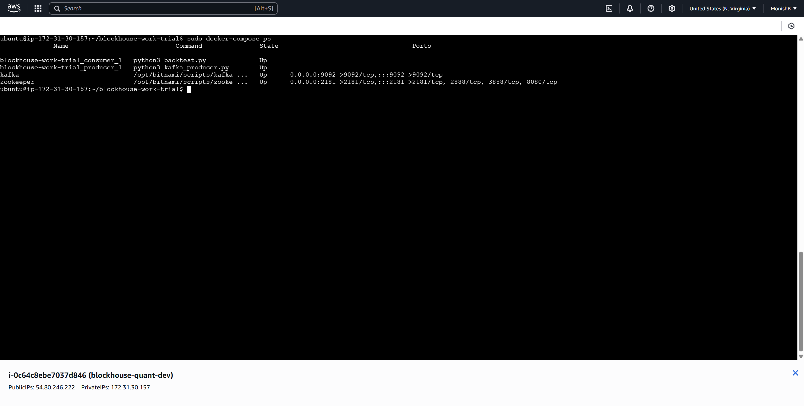
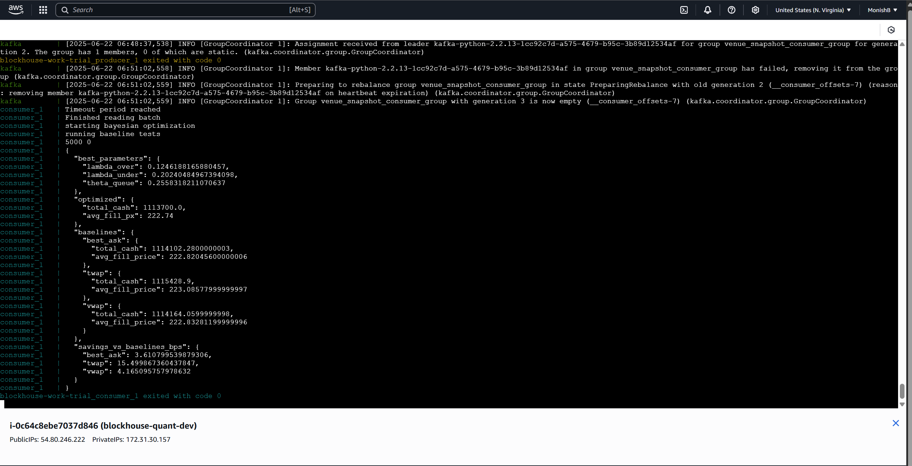
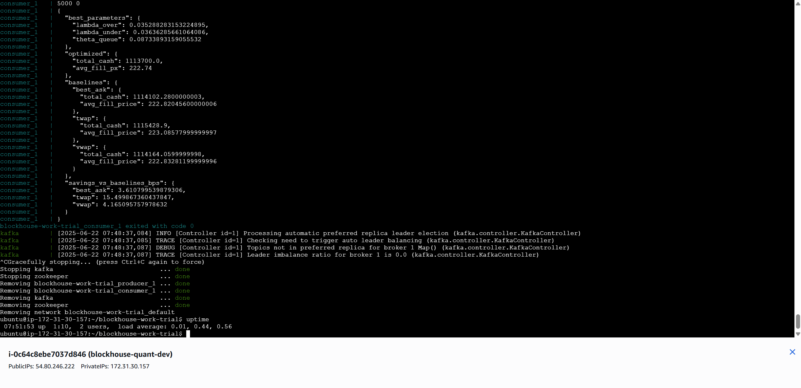

## Youtube Link
https://youtu.be/AQMUxX6ylWc

## Deployment

Connect to a AWS EC2 instance (Ubuntu t3.micro)

Download Dependencies
```bash
sudo apt update && sudo apt upgrade -y
sudo apt install -y docker.io docker-compose python3 python3-pip unzip git
```

Clone Repository
```
git clone https://github.com/MonishB123/blockhouse-work-trial
cd blockhouse-work-trial
```
Add l1_day.csv file through scp or ssh from local machine

Build Docker Container (Builds docker services and runs producer/consumer scripts)
```
sudo chmod +x start.sh
sudo ./start.sh
```

## Screenshots

Backtest and Producer running:


Stdout:


Uptime command:

